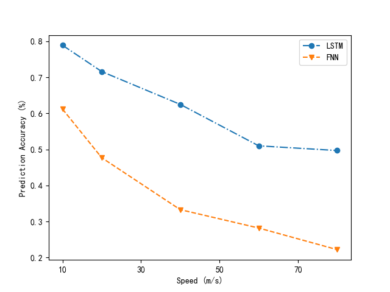

# CQI Prediction

## Introduction

This original work is done based on [5G NR](https://5g-lena.cttc.es/) branch in ns-3. We made some changes to make it
also run in LTE codebase in ns-3 mainline. We didn't reproduce all the experiments on LTE, and the results used in this
document are based on NR work.

### Cmake targets

- `ns3ai_ltecqi_msg`: The LTE-CQI example using struct-based message interface.

## Motivation

- The fast time-varying channel strictly limits the throughput performance of the 5G system.
- In high mobility scenes, the performance of the AMC system is significantly deteriorated, resulting from rapidly
  time-varying channels.
- Reliable channel prediction to forecast the channel variation is necessary.
- CQI also has a great impact on the MAC Scheduler results, and its generation and transmission delay will cause
  inaccuracy in BS.

## Simulation scenario

This scenario is implemented to test the performance of high-speed situations, and multi-users are attached to the base
station to test the downlink scheduling performance.


### Simulation process

1. The user reports the CQI to the BS.
2. BS send the CQI to the online training module.
3. Using LSTM to predict the CQI and shipping back to ns-3.
4. Using the feedback value for the next scheduling decision.

The scheduler type is Round-Robin, which means that every user has an equal number of times being scheduled. 
We mainly concern the total throughput as the performance metric.

## Running the example

1. [Setup ns3-ai](../../install.md)
2. Build C++ side

```shell
cd YOUR_NS3_DIRECTORY
./ns3 build ns3ai_ltecqi_msg
```

3. Run Python script

```shell
pip install -r contrib/ai/examples/lte-cqi/requirements.txt
cd contrib/ai/examples/lte-cqi/use_msg
python run_online_lstm.py 1
```

The parameter `1` is the delta for prediction.

## Results

Results presented in our [paper](https://dl.acm.org/doi/pdf/10.1145/3389400.3389404) are based on the NR code, not the LTE code.

Using the data generated from ns-3, we test the usage rate of different DL algorithms. Two different prediction methods
are applied as the prediction module, the FNN used by another group and LSTM. Form the figure, as the speed improved,
the CQI is more difficult to predict and the usage is down. The LSTM module is much more reliable than the FNN module,
which can have a usage above 50%. As the speed is increasing, the usage is decreasing, and the FNN could not provide a
reliable prediction, but LSTM is still working.


