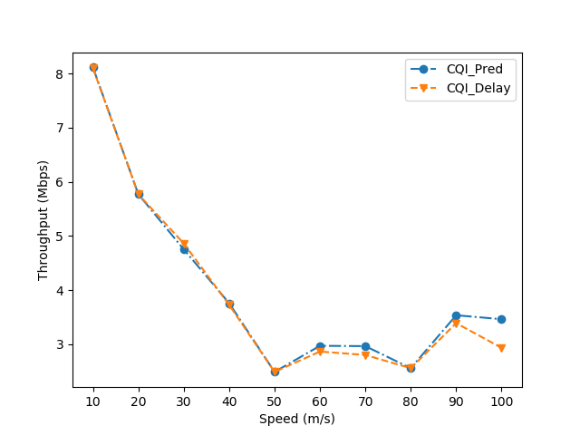

# CQI Prediction

This original work is done based on [5G NR](https://5g-lena.cttc.es/) branch in ns-3. We made some changes to make it
also run in LTE codebase in ns-3 mainline. We didn't reproduce all the experiments on LTE, and the results used in this
document are based on NR work.

## Motivation

- The fast time-varying channel strictly limits the throughput performance of the 5G system.
- In high mobility scenes, the performance of the AMC system is significantly deteriorated, resulting from rapidly
  time-varying channels.
- Reliable channel prediction to forecast the channel variation is necessary.
- CQI also has a great impact on the MAC Scheduler results, and its generation and transmission delay will cause
  inaccuracy in BS.

## CQI prediction simulation in NS3

### Simulation scenario

This scenario is implemented to test the performance of high-speed situations, and multi-users are attached to the base
station to test the downlink scheduling performance.


### Performance Metrics

- Calculate the MSE of the outdated CQI and predicted CQI
- Map the predicted CQI to MCS and data rate
- Use Round Robin as a scheduler to see directly the impact of CQI (Every user has an equal number of times scheduled )
- Mainly concern throughput

### Simulation process

- The user reports the CQI to the BS.
- BS send the CQI to the online training module.
- Using LSTM to predict the CQI and shipping back to ns-3.
- Using the feedback value for the next scheduling decision.

## DL Algorithms Using for Prediction

- Neural Networks(NN): Easy, fast, and was used by the above works.
- Long Short-Term Memory (LSTM) is ideal for dealing with issues that are highly correlated with time series.
- The changing of CQI in the BS side can be evaluated and predicted by the past series of CQI.

## Running the example

1. [Setup ns3-ai](../../install.md)
2. Install requirements:

```shell
pip install tensorflow Keras
```

3. Run Python side

Python side should run first, because Python script is the shared memory creator.

```shell
cd contrib/ns3-ai/examples/lte-cqi
python run_online_lstm.py 1
```

The parameter `1` is the delta for prediction.

4. When you see the message `Created message interface, waiting for C++ side to send initial environment...`, Open
   another terminal and run C++ side.

```shell
./ns3 run ns3ai_ltecqi
```

## Results

Results presented in our [paper](https://dl.acm.org/doi/pdf/10.1145/3389400.3389404) are based on the NR code, not the LTE code.

Using the data generated from ns-3, we test the usage rate of different DL algorithms. Two different prediction methods
are applied as the prediction module, the FNN used by another group and LSTM. Form the figure, as the speed improved,
the CQI is more difficult to predict and the usage is down. The LSTM module is much more reliable than the FNN module,
which can have a usage above 50%. As the speed is increasing, the usage is decreasing, and the FNN could not provide a
reliable prediction, but LSTM is still working.


